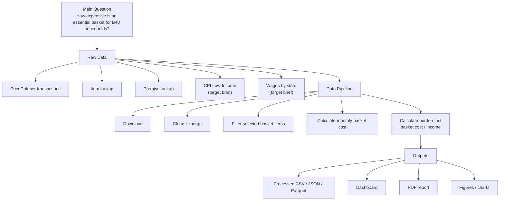
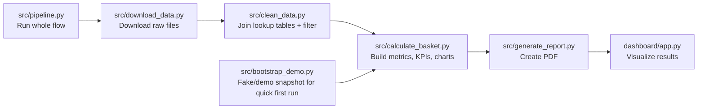
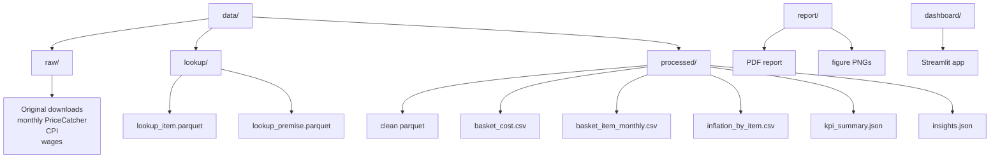
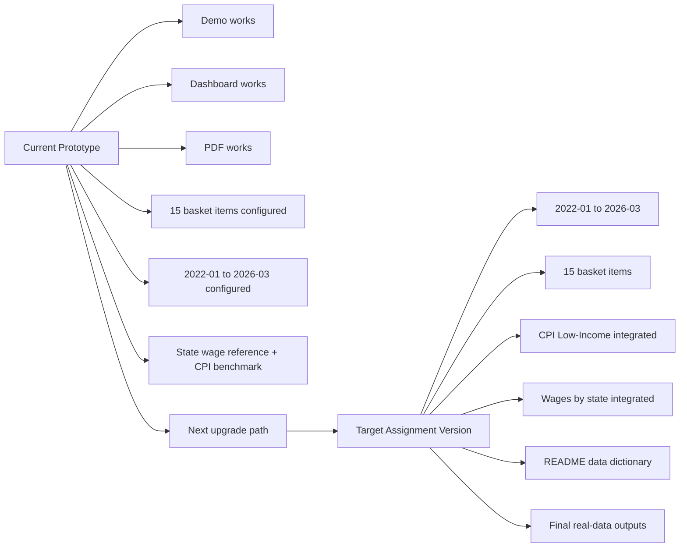
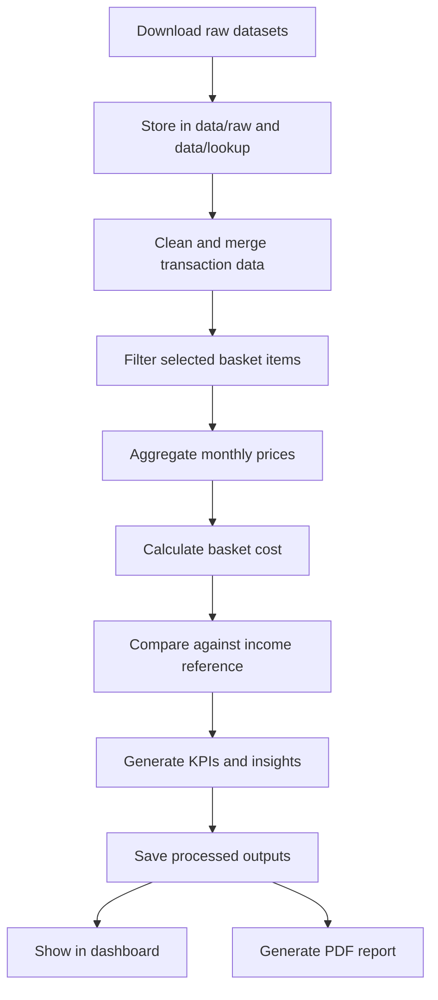

# Project Overview

This document gives a compact visual briefing of the whole project in mix English + Malay so it is easier to understand the big picture.

## Project Idea

This project is a small analytics product to answer:

**"Berapa besar beban harga barang asas kepada isi rumah B40?"**

It takes raw food-price data, cleans it, builds basket-cost metrics, then shows the result in:

- a dashboard at \[dashboard/app.py]\(C:\Users\Acer Evo\Desktop\KerjaIntern\BakulB40\dashboard\app.py)
- a report generated by \[src/generate\_report.py]\(C:\Users\Acer Evo\Desktop\KerjaIntern\BakulB40\src\generate\_report.py)

## How The Repo Works

Think of the scripts like an assembly line.

### Short Description Of Each Script

- `src/download_data.py`: download monthly PriceCatcher files and lookup tables
- `src/clean_data.py`: merge transaction data with item and premise lookup, then filter the relevant basket items
- `src/calculate_basket.py`: calculate monthly basket cost, burden percentage, inflation, volatility, urban-rural gap, and Ramadan effect
- `src/calculate_basket.py`: calculate monthly basket cost, burden percentage, inflation, CPI comparison, volatility, urban-rural gap, and Ramadan effect
- `src/generate_report.py`: build the PDF report from processed outputs
- `dashboard/app.py`: Streamlit dashboard for filters, KPI cards, charts, and data table
- `src/pipeline.py`: run the full pipeline in one command
- `src/bootstrap_demo.py`: generate demo data so the app can run before real data is downloaded

## Folder Logic

This is important because people often confuse `raw` vs `processed`.

### Folder Meaning

- `data/raw/`: original downloaded data, as untouched as possible
- `data/lookup/`: lookup tables like item and premise metadata
- `data/processed/`: cleaned and computed outputs used by dashboard and report
- `report/`: report assets and generated PDF
- `dashboard/`: presentation layer for Streamlit
- `docs/`: supporting project documentation

## Current Project State Vs Target Brief

This is the simplest way to see what is done and what is still missing.

## Main Project Flow

Below is the practical end-to-end flow.

### Stage Notes

- `Download stage`: ambil raw files from official sources and save them in the correct folders
- `Clean stage`: merge raw transaction data with item and premise lookup, remove bad values, and filter relevant items
- `Analysis stage`: calculate average price, basket cost, burden percentage, item inflation, urban-rural gap, and Ramadan effect
- `Output stage`: save processed files for reuse so dashboard/report do not repeat heavy computation every time
- `Presentation stage`: dashboard and PDF are mainly consuming processed outputs, not doing full raw-data cleaning

## Main Metrics In The Project

- `cost_item`: kos bulanan untuk satu item dalam basket
- `basket_cost`: jumlah kos semua item dalam basket
- `burden_pct`: berapa peratus income habis untuk basket
- `price_index`: index perubahan harga ikut masa
- `urban_rural_gap`: beza kos bandar vs luar bandar
- `ramadan_effect`: average basket cost in Ramadan vs non-Ramadan

## Important Mindset

This project is not just "download dataset and plot chart".

It is more like:

1. collect structured data
2. standardize and clean it
3. transform it into policy-style or household affordability metrics
4. present it in a business-friendly and portfolio-friendly form

## Simple Takeaway

Current repo = **working prototype**

Target brief = **full real-data assignment version**

So the current repo already gives:

- a working structure
- a working dashboard
- a working report flow
- a place to continue building

But to fully match the assignment brief, it still needs:

- final real-data outputs
- any final refinement to proxy item selection if your supervisor wants a different representative product mapping
