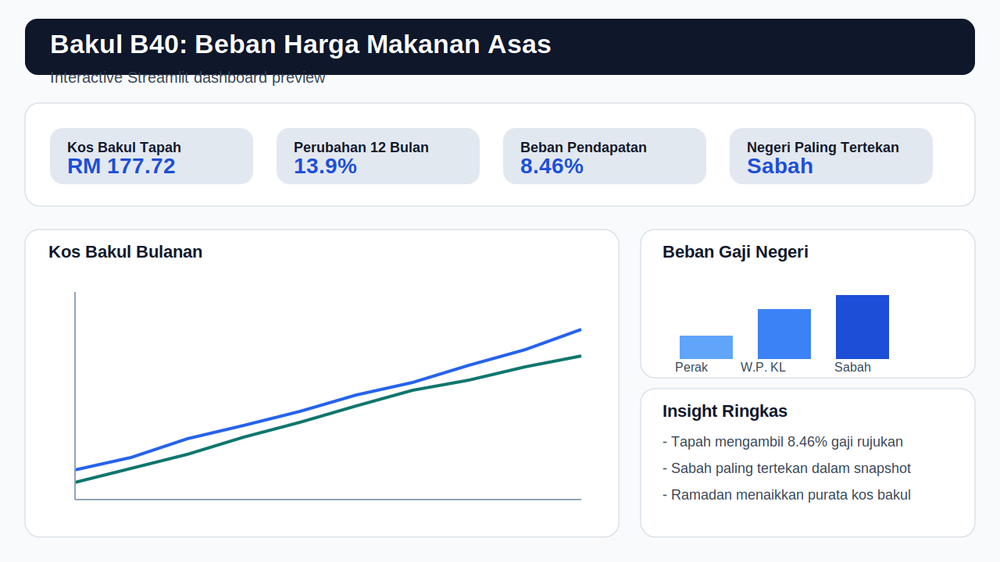

# Bakul B40: Analisis Beban Harga Makanan Asas Malaysia

Projek portfolio data analyst ini mengukur berapa besar tekanan kos 6 barang dapur asas terhadap isi rumah B40 menggunakan data sebenar KPDN PriceCatcher. Fokus analisis ialah melihat bahagian gaji bulanan yang habis untuk bakul makanan asas, perubahan harga mengikut bulan, dan lokasi yang paling tertekan dalam Perak, W.P. Kuala Lumpur, dan Sabah.

## Output Projek

- Dashboard interaktif menggunakan Streamlit di `dashboard/app.py`
- Pipeline data reproducible menggunakan Python, Pandas, DuckDB, Plotly, dan YAML config
- Laporan PDF 3 muka surat di `report/Bakul_B40_2026.pdf`
- Lima visual PNG di `report/figures/`
- Tiga notebook analisis di `notebooks/`
- Skrip video demo 90 saat di `docs/video_demo_script.md`

## Struktur Repository

```text
.
├── config.yaml
├── dashboard/
├── data/
├── docs/
├── notebooks/
├── report/
├── src/
├── .gitignore
├── LICENSE
├── planv1.md
├── readme.md
└── requirements.txt
```

## Masalah Yang Diselesaikan

Barang asas nampak murah jika dilihat satu per satu, tetapi tekanan sebenar kepada isi rumah B40 hanya jelas apabila harga beras, ayam, telur, minyak masak, gula, dan tepung digabungkan sebagai satu bakul bulanan. Projek ini menukar jutaan transaksi mentah PriceCatcher kepada metrik yang mudah difahami: kos bakul bulanan, beban terhadap pendapatan isi rumah, perbezaan bandar-luar bandar, dan item mana yang paling cepat meningkat.

## Sumber Data

- PriceCatcher Transactional Records: [data.gov.my](https://data.gov.my/data-catalogue/pricecatcher), akses pada `2026-04-09`, lesen `CC BY 4.0`
- PriceCatcher `lookup_item.parquet`: `https://storage.data.gov.my/pricecatcher/lookup_item.parquet`
- PriceCatcher `lookup_premise.parquet`: `https://storage.data.gov.my/pricecatcher/lookup_premise.parquet`
- CPI Low-Income Households: [open.dosm.gov.my](https://open.dosm.gov.my/data-catalogue/cpi_low_income), akses pada `2026-04-09`
- Gaji dan upah: [open.dosm.gov.my](https://open.dosm.gov.my), akses pada `2026-04-09`

## Metodologi Ringkas

1. Muat turun 12 bulan PriceCatcher dari `2025-04` hingga `2026-03` bersama lookup item dan premise.
2. Padankan transaksi dengan metadata item dan premis, kemudian tapis kepada 6 barang bakul asas, 3 negeri fokus, dan harga sah sahaja.
3. Kira harga purata bulanan setiap item mengikut daerah, darab dengan kuantiti bakul keluarga 4 orang, dan jumlahkan menjadi kos bakul.
4. Tukarkan kos bakul kepada `burden_pct` berbanding pendapatan rujukan isi rumah B40 sebanyak `RM2,100`.
5. Jana insight tambahan: inflasi item, volatiliti, jurang bandar-luar bandar, dan kesan Ramadan.

## Insight Snapshot

Angka di bawah datang daripada output demo yang dibundel supaya dashboard dan laporan boleh terus berjalan. Jalankan pipeline penuh untuk menggantikan demo ini dengan angka sebenar KPDN.

- Tapah merekodkan kos bakul `RM177.72` pada `2026-03`, bersamaan `8.46%` daripada gaji rujukan `RM2,100`
- Dalam snapshot demo, kenaikan 12 bulan Tapah ialah `13.9%` dari `2025-04` ke `2026-03`
- Dalam bulan terkini demo, negeri dengan beban tertinggi ialah `Sabah` pada sekitar `9.0%` pendapatan rujukan

## Dashboard Preview



## Limitasi

- Repository ini dibundel dengan output demo kecil untuk pengalaman pertama yang cepat; insight muktamad memerlukan muat turun data sebenar.
- Klasifikasi bandar-luar bandar menggunakan heuristik pada metadata premis dan boleh diperketatkan jika label rasmi tersedia.
- Perbandingan beban pendapatan menggunakan satu nilai pendapatan rujukan; analisis lanjutan boleh menggantikan dengan siri rasmi DOSM yang lebih terperinci.

## Cara Run

```bash
python -m venv .venv
.venv\Scripts\activate
pip install -r requirements.txt
python src/bootstrap_demo.py
streamlit run dashboard/app.py
```

Untuk analisis data sebenar:

```bash
python src/download_data.py
python src/clean_data.py
python src/calculate_basket.py
python src/generate_report.py
```

Atau jalankan keseluruhan pipeline:

```bash
python src/pipeline.py --download
```

## Git Publish

```bash
git init
git add .
git commit -m "Projek Bakul B40 siap"
git branch -M main
git remote add origin https://github.com/username/bakul-b40-malaysia.git
git push -u origin main
```

## Kredit Dan Lesen

- Data sumber: `CC BY 4.0` milik data.gov.my dan DOSM mengikut syarat sumber asal
- Kod projek: `MIT`, lihat fail `LICENSE`
